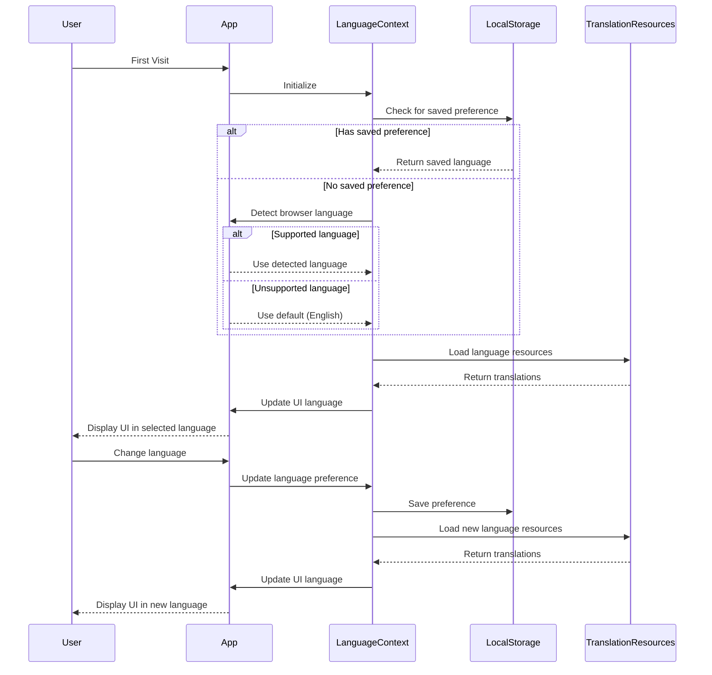
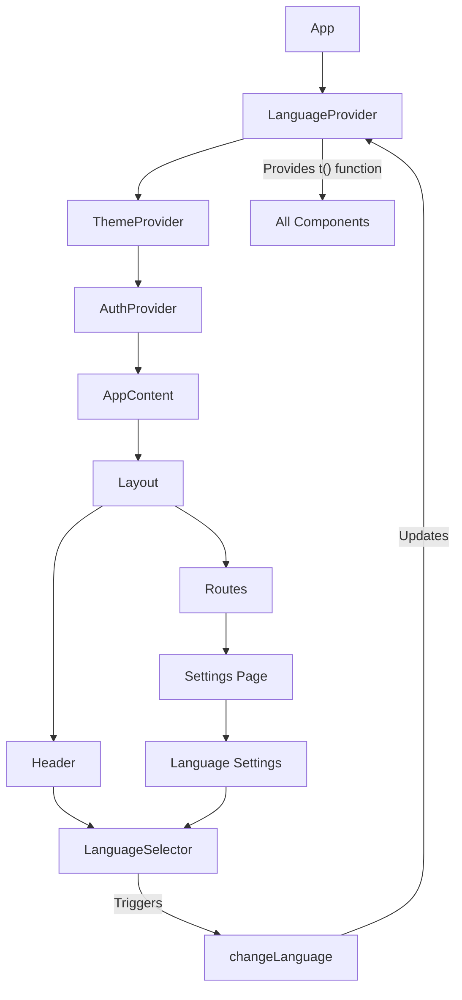
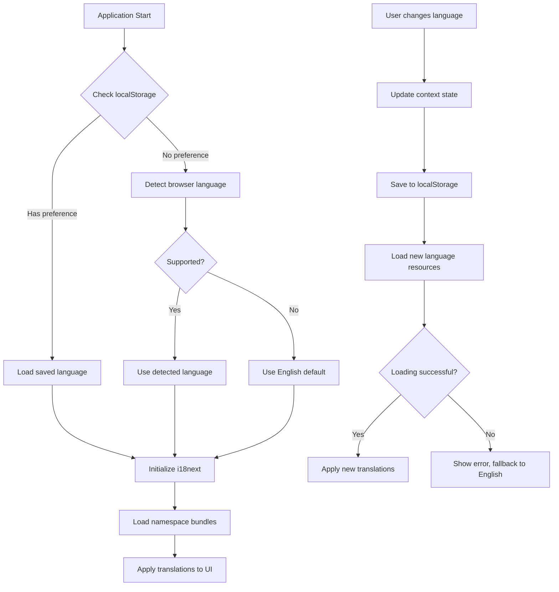

# Design Document: Multi-Language Support

## Overview

This design document outlines the implementation approach for adding multi-language support to the Minimal Chef application. The solution will enable users to interact with the application in their preferred language, with a focus on maintainability, performance, and user experience. The implementation will follow React and TypeScript best practices while integrating with the existing Material UI-based interface.

## Architecture

### Core Components

1. **Translation Management System**
   - We will implement i18next as our translation management library due to its robust feature set, active maintenance, and extensive plugin ecosystem.
   - The system will use a hierarchical structure for organizing translation keys, mirroring the application's component structure.

2. **Language Detection and Selection**
   - Browser language detection will be implemented to automatically select the user's preferred language on first visit.
   - A language selector component will be added to the Settings page and potentially as a quick-access option in the application header.

3. **Persistence Layer**
   - User language preferences will be stored in localStorage to persist across sessions.
   - The selected language will be synchronized with the HTML lang attribute for proper accessibility.

4. **Formatting System**
   - Intl.NumberFormat, Intl.DateTimeFormat, and related APIs will be used for locale-aware formatting of numbers, dates, times, and currencies.

### Integration Points

1. **React Context**
   - A new LanguageContext will be created to manage the current language state and provide translation functions to all components.
   - This context will be integrated at the App level, similar to the existing ThemeProvider and AuthProvider.

2. **Material UI Integration**
   - Material UI components will be configured to respect RTL text direction when appropriate.
   - Theme configurations will be updated to accommodate language-specific styling needs.

3. **Existing Components**
   - All text content in existing components will be refactored to use the translation system.
   - Special attention will be given to components with dynamic content or complex formatting.

## Components and Interfaces

### LanguageProvider Component

```typescript
interface LanguageContextType {
  currentLanguage: string;
  changeLanguage: (lang: string) => Promise<void>;
  t: TFunction; // Translation function from i18next
  languages: LanguageOption[];
  isRTL: boolean;
}

interface LanguageOption {
  code: string;
  name: string;
  nativeName: string;
  direction: 'ltr' | 'rtl';
  flag?: string;
}

const LanguageProvider: React.FC<{ children: React.ReactNode }> = ({
  children,
}) => {
  // Implementation details
};
```

### LanguageSelector Component

```typescript
interface LanguageSelectorProps {
  variant: 'menu' | 'dropdown' | 'list';
  showFlags?: boolean;
  showNativeNames?: boolean;
}

const LanguageSelector: React.FC<LanguageSelectorProps> = (props) => {
  // Implementation details
};
```

### TranslationNamespace Interface

```typescript
interface TranslationNamespace {
  [key: string]: string | TranslationNamespace;
}
```

## Data Models

### Translation File Structure

```
/public
  /locales
    /en
      common.json
      recipes.json
      settings.json
      ...
    /es
      common.json
      recipes.json
      settings.json
      ...
    /fr
      ...
```

### Translation JSON Structure

```json
{
  "common": {
    "appName": "Minimal Chef",
    "navigation": {
      "home": "Home",
      "recipes": "Recipes",
      "shopping": "Shopping List",
      "settings": "Settings"
    },
    "actions": {
      "save": "Save",
      "cancel": "Cancel",
      "delete": "Delete",
      "edit": "Edit"
    }
  }
}
```

### Language Configuration

```typescript
const supportedLanguages: LanguageOption[] = [
  {
    code: 'en',
    name: 'English',
    nativeName: 'English',
    direction: 'ltr',
    flag: '🇺🇸',
  },
  {
    code: 'es',
    name: 'Spanish',
    nativeName: 'Español',
    direction: 'ltr',
    flag: '🇪🇸',
  },
  {
    code: 'fr',
    name: 'French',
    nativeName: 'Français',
    direction: 'ltr',
    flag: '🇫🇷',
  },
  {
    code: 'ar',
    name: 'Arabic',
    nativeName: 'العربية',
    direction: 'rtl',
    flag: '🇸🇦',
  },
  // Additional languages will be added here
];
```

## Error Handling

1. **Missing Translations**
   - The system will fall back to English when a translation is missing.
   - In development mode, missing translations will be logged to the console.
   - A development utility will be created to identify missing translations.

2. **Language Loading Failures**
   - If loading a language resource fails, the application will fall back to English.
   - Users will be notified of the failure with an option to retry.

3. **Persistence Failures**
   - If storing the language preference fails, the application will continue to function with the selected language for the current session.
   - A warning will be logged to the console in development mode.

## Testing Strategy

1. **Unit Tests**
   - Test the LanguageContext provider and hooks for proper state management.
   - Test the language detection and selection logic.
   - Test the persistence mechanism.

2. **Component Tests**
   - Test the LanguageSelector component for proper rendering and interaction.
   - Test key components with different languages to ensure proper rendering.

3. **Integration Tests**
   - Test the complete language switching flow.
   - Test the application's behavior when switching between LTR and RTL languages.

4. **End-to-End Tests**
   - Test the full application with different languages to ensure a consistent user experience.
   - Test persistence of language preferences across sessions.

## Performance Considerations

1. **Lazy Loading**
   - Translation resources will be loaded on demand using dynamic imports.
   - Only the selected language's resources will be loaded to minimize bundle size.

2. **Caching**
   - Translation resources will be cached in memory to avoid repeated network requests.
   - The i18next-localstorage-backend plugin will be used to cache translations in localStorage.

3. **Optimization**
   - Translation keys will be organized to minimize the size of individual translation files.
   - Critical translations will be included in the initial bundle to avoid loading delays.

4. **Monitoring**
   - Performance metrics will be collected to identify any impact on application load time or runtime performance.

## Implementation Considerations

### RTL Support

For right-to-left (RTL) languages like Arabic and Hebrew:

1. Material UI's RTL support will be enabled through the `dir` attribute and theme configuration.
2. CSS will be updated to use logical properties (e.g., `margin-inline-start` instead of `margin-left`) where appropriate.
3. Component layouts will be tested in both LTR and RTL modes to ensure proper rendering.

### Accessibility

1. The HTML `lang` attribute will be updated when the language changes.
2. ARIA attributes will be preserved during translation.
3. Screen reader announcements will be made when the language changes.

### Internationalization Beyond Text

1. Date and time formatting will use `Intl.DateTimeFormat` with the appropriate locale.
2. Number formatting will use `Intl.NumberFormat` with the appropriate locale.
3. Currency formatting will respect locale conventions.

## Diagrams

### Language Selection Flow



### Component Architecture



### Translation Loading Process


